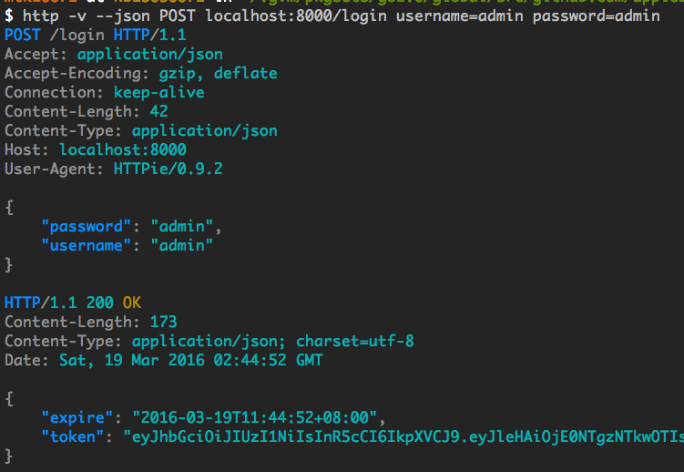
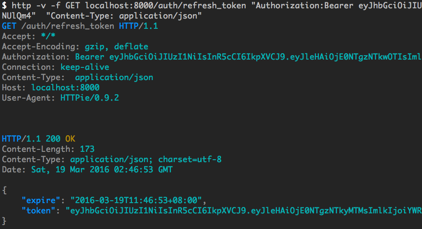

# JWT Middleware for Gin Framework

[](https://godoc.org/github.com/appleboy/gin-jwt) [](https://travis-ci.org/appleboy/gin-jwt) [](https://drone.io/github.com/appleboy/gin-jwt/latest) [](https://goreportcard.com/report/github.com/appleboy/gin-jwt) [](https://coveralls.io/github/appleboy/gin-jwt?branch=master) [](https://codebeat.co/projects/github-com-appleboy-gin-jwt) [](https://raw.githubusercontent.com/appleboy/gin-jwt/master/LICENSE)

This is a middleware for [Gin](https://github.com/gin-gonic/gin) framework.

It uses [jwt-go](https://github.com/dgrijalva/jwt-go) to provide a jwt authentication middleware. It provides additional handler functions to provide the `login` api that will generate the token and an additional `refresh` handler that can be used to refresh tokens.

## Install

Install gin-gwt `v1` version if `jwt-go` using [v2](http://gopkg.in/dgrijalva/jwt-go.v2) version. To get the package, execute:

```bash
$ go get gopkg.in/appleboy/gin-jwt.v1
```

To import this package, add the following line to your code:

```go
import "gopkg.in/appleboy/gin-jwt.v1"
```

## Example

Please see [server example file](example/server.go).

```go
package main

import (
  "github.com/appleboy/gin-jwt"
  "github.com/fvbock/endless"
  "github.com/gin-gonic/gin"
  "os"
  "time"
)

func HelloHandler(c *gin.Context) {
  c.JSON(200, gin.H{
    "text": "Hello World.",
  })
}

func main() {
  port := os.Getenv("PORT")
  r := gin.New()
  r.Use(gin.Logger())
  r.Use(gin.Recovery())

  if port == "" {
    port = "8000"
  }

  // the jwt middleware
  authMiddleware := &jwt.GinJWTMiddleware{
    Realm:      "test zone",
    Key:        []byte("secret key"),
    Timeout:    time.Hour,
    MaxRefresh: time.Hour * 24,
    Authenticator: func(userId string, password string, c *gin.Context) (string, bool) {
      if (userId == "admin" && password == "admin") || (userId == "test" && password == "test") {
        return userId, true
      }

      return userId, false
    },
    Authorizator: func(userId string, c *gin.Context) bool {
      if userId == "admin" {
        return true
      }

      return false
    },
    Unauthorized: func(c *gin.Context, code int, message string) {
      c.JSON(code, gin.H{
        "code":    code,
        "message": message,
      })
    },
  }

  r.POST("/login", authMiddleware.LoginHandler)

  auth := r.Group("/auth")
  auth.Use(authMiddleware.MiddlewareFunc())
  {
    auth.GET("/hello", HelloHandler)
    auth.GET("/refresh_token", authMiddleware.RefreshHandler)
  }

  endless.ListenAndServe(":"+port, r)
}
```

## Demo

Please run example/server.go file and listen `8000` port.

```bash
$ go run example/server.go
```

Download and install [httpie](https://github.com/jkbrzt/httpie) CLI HTTP client.

### Login API:

```bash
$ http -v --json POST localhost:8000/login username=admin password=admin
```

Output screenshot



### Refresh token API:

```bash
$ http -v -f GET localhost:8000/auth/refresh_token "Authorization:Bearer xxxxxxxxx"  "Content-Type: application/json"
```

Output screenshot



### Hello world

Please login as `admin` and password as `admin`

```bash
$ http -f GET localhost:8000/auth/hello "Authorization:Bearer xxxxxxxxx"  "Content-Type: application/json"
```

Response message `200 OK`:

```
HTTP/1.1 200 OK
Content-Length: 24
Content-Type: application/json; charset=utf-8
Date: Sat, 19 Mar 2016 03:02:57 GMT

{
    "text": "Hello World."
}
```

### Authorization

Please login as `test` and password as `test`

```bash
$ http -f GET localhost:8000/auth/hello "Authorization:Bearer xxxxxxxxx"  "Content-Type: application/json"
```

Response message `403 Forbidden`:

```
HTTP/1.1 403 Forbidden
Content-Length: 62
Content-Type: application/json; charset=utf-8
Date: Sat, 19 Mar 2016 03:05:40 GMT
Www-Authenticate: JWT realm=test zone

{
    "code": 403,
    "message": "You don't have permission to access."
}
```
